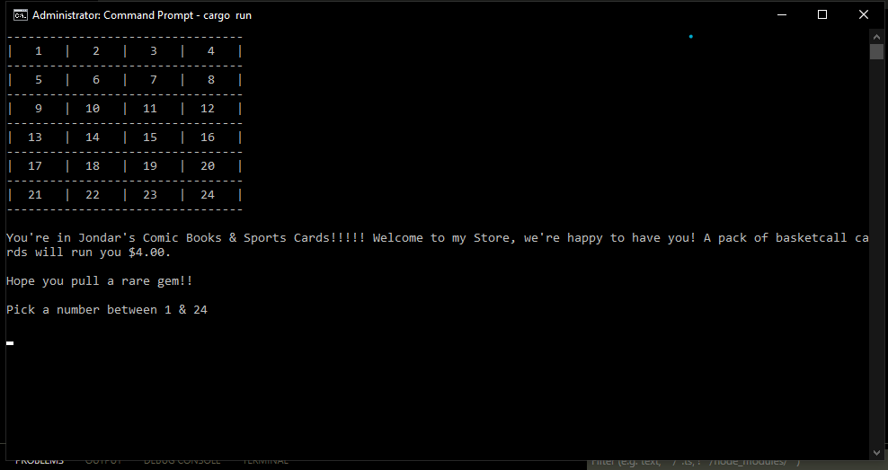
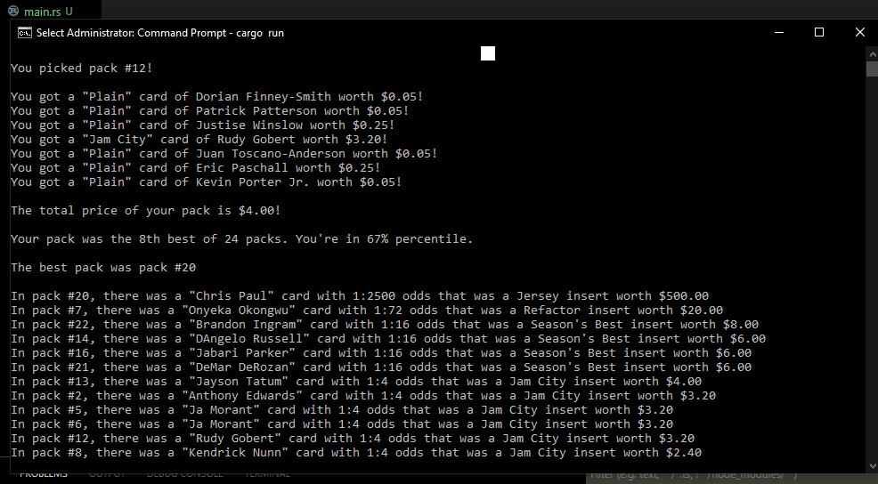

Disclaimer: I am very new at Rust, and there may be lots of code that's not idiomatic or ideally Rust-ic in best practices.

Rust is one of those amazing languages that you would want to know in life. I love low-level programming & working as close to the metal as I can, just as much as I enjoy high-level languages to abstract away many of the details for pseudocode or to churn out agile deliverables at a faster speed.

I had enormous fun coding in Rust, and I can see why it's one of the most LOVED computer languages out there. C++ has to be mindful of this emerging threat, or they may become like Ada & Pascal & Delphi! I believe it's loved because I observe many functions for the many default types to ease development. It's also loved because it indeed has a massive learning curve that makes adherents relieved when they feel they finally get it and finally become fluent in it. They also love how they have elements of high-level libraries/programming with low-level speed, while still programming in the low-level way. As well as the fact that there's no dangling pointers or memory leaks


I kind of wish I did this years ago.

I am very very far from a Rustacean & a Rust expert. There are some mistakes that I made here that I wouldn't do next time I make a program.

I'm pleased that my first rust program was 400 lines. It's not the best "Rust" or idiomatic "Rust-ic", but it's far better than my first Python program.

So.....this program simulates the experience when you buy a pack of Sports Card in the store! You pick a pack from a box, and you see what you pulled from the back, and if your pack was one of the best or not, as well as what was in each box. It takes you back to an earlier point in your life. Glad to have done this in Rust.

For the eagle eyed viewer, each of the Inserts came from different packs of cards from the past, such as "Topps", "Fleer Metal", "Skybox", "Upper Deck" and so forth!

Read the code to know what's going on, or ask me questions.

Autograph /
	"Name" = "Autograph"/
	"Odds" = 1:72/
AtomicRefractor /
	"Name" = "Atomic Refractor"/
	"Odds" = 1:244/
PatchAutograph /
	"Name" = "Patch Autograph"/
	"Odds" = 1:60000/
Plain /
	"Name" = "Plain"/
	"Odds" = 1:1/
Patch /
	"Name" = "Patch"/
	"Odds" = 1:7500/
Refractor /
	"Name" = "Refactor"/
	"Odds" = 1:72/
Jersey /
	"Name" = "Jersey"/
	"Odds" = 1:2500/
Insert(1) /
	"Name" = "Jam City"/
	"Odds" = 1:4/
Insert(2) /
	"Name" = "Season's Best"/
	"Odds" = 1:16/
Insert(3) /
	"Name" = "Rock Stars"/
	"Odds" = 1:36/
Insert(4) /
	"Name" = "Quick Strike"/
	"Odds" = 1:96/
Insert(5) /
	"Name" = "Thunder & Lightning"/
	"Odds" = 1:144/
Insert(6) /
	"Name" = "NetRageous"/
	"Odds" = 1:288/
Insert(7) /
	"Name" = "Hardware"/
	"Odds" = 1:/






```rust
#![allow(warnings, unused)]
mod players;
mod clear_console;
use std::ops::Deref;
use std::io;
use rand::Rng;
use rand::thread_rng;
use rand::seq::SliceRandom;
const amount_of_cards_in_pack:i8 = 7;
const amount_of_packs_in_box:i8 = 24;
#[derive(Debug, PartialEq,Clone)]
enum SportsCardEnum
{
    Plain,
    Insert(i32),
    Refractor,
    AtomicRefractor,
    Autograph,
    Jersey,
    Patch,
    PatchAutograph,
}

impl SportsCardEnum {
    pub fn odds(&self) -> i32 {
        match self {
            SportsCardEnum::PatchAutograph => 60000,
            SportsCardEnum::Patch => 7500,
            SportsCardEnum::Jersey => 2500,
            SportsCardEnum::Insert(7) => 360,
            SportsCardEnum::Insert(6) => 288,
            SportsCardEnum::Insert(5) => 144,
            SportsCardEnum::AtomicRefractor => 244,
            SportsCardEnum::Autograph => 128,
            SportsCardEnum::Insert(4) => 96,
            SportsCardEnum::Refractor => 72,
            SportsCardEnum::Insert(3) => 36,
            SportsCardEnum::Insert(2) => 16,
            SportsCardEnum::Insert(1) => 4,
            SportsCardEnum::Plain => 4,
            _ => 1
        }
    }
    pub fn name_of_insert(&self) -> &str {
        match self {
            SportsCardEnum::Autograph => "Autograph",
            SportsCardEnum::AtomicRefractor => "Atomic Refractor",
            SportsCardEnum::PatchAutograph => "Patch Autograph",
            SportsCardEnum::Plain => "Plain",
            SportsCardEnum::Patch => "Patch",
            SportsCardEnum::Refractor => "Refactor",
            SportsCardEnum::Jersey => "Jersey",
            SportsCardEnum::Insert(1) => "Jam City",
            SportsCardEnum::Insert(2) => "Season's Best",
            SportsCardEnum::Insert(3) => "Rock Stars",
            SportsCardEnum::Insert(4) => "Quick Strike",
            SportsCardEnum::Insert(5) => "Thunder & Lightning",
            SportsCardEnum::Insert(6) => "NetRageous",
            SportsCardEnum::Insert(7) => "Hardware",
            _ => "Plain"
        }
    }
    pub fn multiplier(&self) -> f32
    {
        match self
        {
            SportsCardEnum::PatchAutograph => 5000.0,
            SportsCardEnum::Patch => 2000.0,
            SportsCardEnum::Jersey => 1000.0,
            SportsCardEnum::Insert(6) => 150.0,
            SportsCardEnum::AtomicRefractor => 130.0,
            SportsCardEnum::Insert(5) => 100.0,
            SportsCardEnum::Autograph => 75.0,
            SportsCardEnum::Insert(4) => 75.0,
            SportsCardEnum::Refractor => 75.0,
            SportsCardEnum::Insert(3) => 25.0,
            SportsCardEnum::Insert(2) => 20.0,
            SportsCardEnum::Insert(1) => 8.0,
            SportsCardEnum::Plain => 1.0,
            _ => 1.0,
        }
    }
}
#[derive(Debug,Clone)]
struct SportsCard
{
    sports_card_type: SportsCardEnum,
    player_name: String,
    player_tier: i8,
    price: f32
}
impl SportsCard {
    fn get_price(&self) -> f32 {
        let base_price: f32 = match self.player_tier
        {
            _ if self.player_tier == 1 => 2.0,
            _ if self.player_tier == 2 => 0.5,
            _ if self.player_tier == 3 => 0.4,
            _ if self.player_tier == 4 => 0.3,
            _ if self.player_tier == 5 => 0.25,
            _ if self.player_tier == 6 => 0.20,
            _ if self.player_tier == 7 => 0.15,
            _ if self.player_tier == 8 => 0.05,
            _ => 1.0,
        };
        let multiplier: f32 = self.sports_card_type.multiplier();
        let mut price = (base_price * multiplier);
        price = match price
        {
            _ if price >= 50.0 => price - (price % 10.0),
            _ if price >= 20.0 => price - (price % 5.0),
            _ => price
        };
        price
    }    
}
impl Default for SportsCard 
{
     fn default() -> Self { 
        SportsCard { 
            sports_card_type: SportsCardEnum::Plain,
            player_name: "None".to_string(),
            price: 1.50,
            player_tier: 8
        }
     }
}
#[derive(Debug)]
struct Pack
{
    cards: Vec<SportsCard>,
    status_of_pack: SportsCardEnum,
    begin_border: usize,
    begin_insert_border: usize,
}
impl Pack {
    fn get_regular_card(&mut self) -> SportsCard
    {
        let mut player_tuples = players::player_tuples;
        let mut rng = thread_rng();
        player_tuples.shuffle(&mut thread_rng());
        let player_tuple_length = player_tuples.len();
        let shuffle_interval = 7;
        let mut end_border = self.begin_border + shuffle_interval;
        let index = rng.gen_range(self.begin_border..end_border);
        let player = player_tuples[index];
        //iterate to next level in tuple for the next function call
        self.begin_border = self.begin_border + shuffle_interval;
        let mut regular_card = SportsCard
        { 
            sports_card_type: SportsCardEnum::Plain,
            player_name: player.0.to_string(),
            player_tier: player.1,
            ..Default::default() 
        };
        regular_card.price = regular_card.get_price();
        regular_card
    }
    fn get_insert(&mut self, sports_card_type: SportsCardEnum) -> SportsCard {
        let mut player_tuples = players::player_tuples;
        player_tuples.shuffle(&mut thread_rng());
        // Only those ranked 1 to 4 ( Vec<&(&str, i8) )
        let mut player_inserts_tuple = player_tuples.iter().filter(|player| player.1 <= 4).collect::< Vec<_> > ();
        let mut rng = thread_rng();
        player_inserts_tuple.shuffle(&mut thread_rng());
        let player_inserts_tuple_length = player_inserts_tuple.len();
        let shuffle_interval = 7;
        let mut end_border = self.begin_insert_border + shuffle_interval;
        let index = rng.gen_range(self.begin_insert_border..end_border);
        let player_insert = player_inserts_tuple[index];
        //iterate to next level in tuple for the next function call
        self.begin_insert_border = self.begin_insert_border + shuffle_interval;
        let mut insert = SportsCard
        { 
            sports_card_type: sports_card_type,
            player_name: player_insert.0.to_string(),
            player_tier: player_insert.1,
            ..Default::default() 
        };
        insert.price = insert.get_price();
        insert
    }
    fn fill_pack(&mut self) -> () 
    {
        let mut cards: Vec<SportsCard> = vec![];
        let mut rng = thread_rng();
        let random_number = rng.gen_range(0..60000);
        let pack_insert_type: SportsCardEnum = match random_number
        {
            _ if random_number % SportsCardEnum::PatchAutograph.odds() == 0  => SportsCardEnum::PatchAutograph,
            _ if random_number % SportsCardEnum::Patch.odds() == 1  => SportsCardEnum::Patch,
            _ if random_number % SportsCardEnum::Jersey.odds() == 2  => SportsCardEnum::Jersey,
            _ if random_number % SportsCardEnum::Insert(6).odds() == 3  => SportsCardEnum::Insert(6),   
            _ if random_number % SportsCardEnum::AtomicRefractor.odds() == 4  => SportsCardEnum::AtomicRefractor,
            _ if random_number % SportsCardEnum::Insert(5).odds() == 5  => SportsCardEnum::Insert(5),
            _ if random_number % SportsCardEnum::Autograph.odds() == 6  => SportsCardEnum::Autograph,
            _ if random_number % SportsCardEnum::Insert(4).odds() == 7  => SportsCardEnum::Insert(4),
            _ if random_number % SportsCardEnum::Refractor.odds() == 8  => SportsCardEnum::Refractor,
            _ if random_number % SportsCardEnum::Insert(3).odds() == 9  => SportsCardEnum::Insert(3),
            _ if random_number % SportsCardEnum::Insert(2).odds() == 10  => SportsCardEnum::Insert(2),
            _ if random_number % SportsCardEnum::Insert(1).odds() == 0  => SportsCardEnum::Insert(1),
            _ => SportsCardEnum::Plain,
        };
        self.status_of_pack = pack_insert_type.clone();
        for i in (0..amount_of_cards_in_pack)
        {
            let mut card = self.get_regular_card();
            card.price = card.get_price();
            cards.push(card);
        }
        //If there is an insert, put ONE insert in
        cards[3] = match pack_insert_type
        {
            _ if pack_insert_type != SportsCardEnum::Plain => {
                let mut insert = self.get_insert(pack_insert_type);
                insert.price = insert.get_price();
                insert
            },
            _ => self.get_regular_card()
        };
        self.cards = cards.clone();
        //regular cards gone
    }
    fn display(&self) -> ()
    {
        let mut price = 0.0;
        println!("");
        for card in &self.cards
        {
            println!("You got a {:?} card of {} worth ${:.2}!", card.sports_card_type.name_of_insert(), card.player_name, card.price);
            price += card.price;
        }
        println!("");
        println!("The total price of your pack is ${:.2}!", price.round());
        println!("");
    } 
    fn get_price(&self) -> f32
    {
        let mut pack_price = 0.0;
        for card in &self.cards
        {
            pack_price += card.price;
        }
        pack_price
    }
}
impl Default for Pack 
{
     fn default() -> Self { 
        Pack { 
            cards: vec![],
            status_of_pack: SportsCardEnum::Plain,
            begin_border: 0,
            begin_insert_border: 0
        }
     }
}
#[derive(Debug)]
struct Box
{
    packs: Vec<Pack>,
    best_pack: Pack
}
impl Box {
    fn fill_box(&mut self) {
    }
    fn new() -> Box
    {
        let mut packs = vec![];
        for i in (0..amount_of_packs_in_box)
        {
            let mut pack = Pack::default();
            pack.fill_pack();
            packs.push(pack);
        } 
        Box { packs , ..Default::default()}
    }
    fn retrieve_pack(&self,numeric_choice: i8) -> &Pack 
    {
        let index = numeric_choice as usize;
        let packs = &self.packs;
        //zero-indexed
        let pack = packs.get(index-1).unwrap();
        pack
    }
    fn greatest_cards(&self) -> Pack 
    {
        let mut largest_pack_price = 0.0;
        let mut largest_pack_index: usize = 0;
        let mut best_cards: Vec<(SportsCard,usize)> = vec![];
        let packs = &self.packs;
        for (pack_index, pack) in packs.iter().enumerate()
        {
            let mut current_pack_price = 0.0;
            for card in &pack.cards
            {
                current_pack_price += card.price;
                best_cards.push((card.clone(),pack_index));          
            }
            //traverse the best cards vector
            if current_pack_price > largest_pack_price
            {
                largest_pack_price = current_pack_price;
                largest_pack_index = pack_index;
            }
        }
        let mut best_cards = best_cards.iter().filter(|a| a.0.sports_card_type != SportsCardEnum::Plain).collect::< Vec<_> >();
        best_cards.sort_by(|a,b| (b.0.price).partial_cmp(&a.0.price).unwrap_or(core::cmp::Ordering::Equal));
        println!("The best pack was pack #{}\n", largest_pack_index + 1);
        for best_card_tuple in best_cards
        {
            println!("In pack #{}, there was a {:?} card with 1:{:#} odds that was a {} insert worth ${:.2}", best_card_tuple.1 + 1, best_card_tuple.0.player_name, best_card_tuple.0.sports_card_type.odds(), best_card_tuple.0.sports_card_type.name_of_insert(), best_card_tuple.0.price);
        }
        (Pack{..Default::default()})
    }   
    fn ranking_pack(&self, user_pack: &Pack) -> () 
    {
        let mut pack_prices_vector = vec![];
        //fill vector of pack prices
        for pack in &self.packs
        {
            let mut pack_price = 0.0;
            pack_prices_vector.push(pack.get_price());
        }
        pack_prices_vector.sort_by(|a, b| a.partial_cmp(b).unwrap());
        let mut tracking_index = 0;
        let user_pack_price = user_pack.get_price();
        for (i,pack_price) in pack_prices_vector.iter().enumerate()
        {
            if user_pack_price <= *pack_price
            {
                tracking_index = i;
                break;
            }
        }
        let rank = amount_of_packs_in_box - tracking_index as i8;  
        let rank_suffix = match rank % 10
        {
            1 => "st",
            2 => "nd",
            _ => "th"
        };
        let percentile = ((tracking_index as f32/24.0)*100.0).round();
        //zero-index to human index
        println!("Your pack was the {:#}{} best of {:#} packs. You're in {}% percentile.\n", rank,rank_suffix,pack_prices_vector.len(),percentile);
    }
}
impl Default for Box {
     fn default() -> Self { 
        Box {
            packs: vec![],
            best_pack: Pack::default()
        }
    }
}
fn main() {
    clear_console::clear();
    let mut choice = String::new();
    while choice.trim().to_lowercase() != "q" && choice.trim().to_lowercase() != "quit" && choice.trim().to_lowercase() != "no" 
    {
        let mut box_instance = Box::new();
        println!("{}","---------------------------------");
        println!("{}","|   1   |   2   |   3   |   4   |");
        println!("{}","---------------------------------");
        println!("{}","|   5   |   6   |   7   |   8   |");
        println!("{}","---------------------------------");
        println!("{}","|   9   |  10   |  11   |  12   |");
        println!("{}","---------------------------------");
        println!("{}","|  13   |  14   |  15   |  16   |");
        println!("{}","---------------------------------");
        println!("{}","|  17   |  18   |  19   |  20   |");
        println!("{}","---------------------------------");
        println!("{}","|  21   |  22   |  23   |  24   |");
        println!("{}","---------------------------------\n");
        println!("{}","You're in Jondar's Comic Books & Sports Cards!!!!! Welcome to my Store, we're happy to have you! A pack of basketcall cards will run you $4.00.\n");
        println!("{}","Hope you pull a rare gem!!\n");
        let mut message_to_user = format!("Pick a number between 1 & {}\n", amount_of_packs_in_box); 
        let mut numeric_choice = 0;
        loop
        {
            choice.clear();
            println!("{}",message_to_user);
            io::stdin().read_line(&mut choice).expect("error: unable to read user choice");
            numeric_choice = choice.trim().parse::<i8>().unwrap_or(-1);
            //bad
            if numeric_choice <  1 || numeric_choice > amount_of_packs_in_box 
            {
                message_to_user = format!("Don't be silly. Choose a correct pack number between 1 & {}...  ",amount_of_packs_in_box);
                continue;
            }
            else
            {
                break;
            }
        }
        // Box.greatest_cards();    
        clear_console::clear();
        let pack = box_instance.retrieve_pack(numeric_choice);
        println!("\nYou picked pack #{}!",choice.trim());
        pack.display();
        box_instance.ranking_pack(&pack);
        box_instance.greatest_cards();
        println!("\nDo you want to open a pack from another box of cards?");
        println!("\n(Write \"No\" or \"Q\" or \"Quit\" if you want to leave)\n");
        choice.clear();
        io::stdin().read_line(&mut choice).expect("error: unable to read user choice");
        clear_console::clear();
    }
}

```